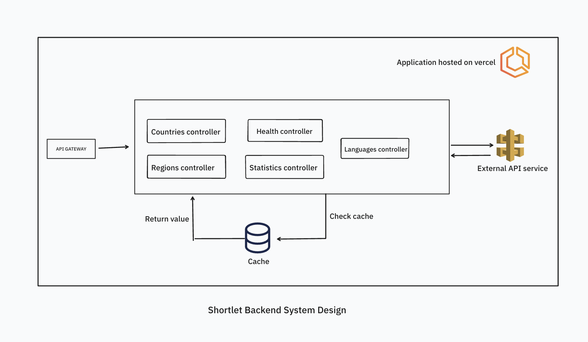

<p align="center"><b>Shortlet Test</b> <br><br> This project integrates data from the <a href="https://restcountries.com/">REST Countries API</a>. This exercise will evaluate your skills in data handling, API design, security, performance optimization, and documentation. 
</p>

<br>

<p align="center">
    
</p>


<br><br>

# Documentation
  * Architecture - [Go to architecture documentation](./docs/architecture.md)

  * <p>Repository - <a target="_blank" href="https://github.com/oyeyipo45/temp-lets">SHORTLET BACKEND REPOSITORY </a></p>
  * <p>Swagger documentation - <a target="_blank" href="https://shortlet-backend.vercel.app/api-docs">SWAGGER API DOCUMENTATION </a></p>
  * <p>Local Swagger documentation - <a target="_blank" href="http://localhost:8850/api-docs">LOCAL API DOCUMENTATION </a></p>
    *  The application should be running before testing the local api documentation <br><br>


# Quick Local Setup Guide
* To run the shortlet backend locally, follow the steps below:

* Clone repository
  ```
  git clone --depth 1 https://github.com/oyeyipo45/temp-lets
  ```

* Go to folder
  ```
  cd temp-lets/
  ```

* Install the project dependencies.
  ```
  npm run install
  ```

* In the root folder of the project, create a `.env` file and add the following values.
  ```
  NODE_ENV="local"
  APP_PORT=8850
  EXTERNAL_COUNTRIES_SERVICES_URL="https://restcountries.com/v3.1"
  ```

* Start the application in development mode.
  ```
  npm run start:dev
  ```

* Access application on local host and check external api health
  ```
  http://localhost:8850/v1/api/health/external-api-health
  ```

* Local API documentation
  ```
  http://localhost:8850/api-docs
  ```

* To run e2e tests in development mode.
  ```
  npm run test:e2e
  ```

* To run unit tests (controllers) in development mode.
  ```
  npm run test
  ```

# Implementaion approach
Architecture - [Go to architecture documentation](./docs/architecture.md)

# Challenges
* Caching and deciding time frame to invalidate cache
* To run unit tests (controllers) in development mode
* Data processing

# Features include
  * E2E and unit tests.
  * Filtering countries
  * Logging

# Potential Improvements
* Logging using datadog
* Using redis for caching instead of Nestjs default cache manager
* Extensive error handling


# Aspect I'm most proud of
* The overall project structure 
   * This makes the application easily extendable
   * We could easily swap data sources with minimal updates 
* The losely coupled nature of the application
   * Services are independent of each other

