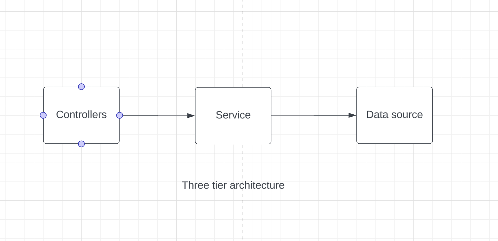

# Architecture

---

## Table of contents

- [Three tier Architecture](#three-tier-architecture)
- [Motivation](#motivation)
- [Description of the module structure](#description-of-the-module-structure)

---

## Three tier Architecture

This project is build based on the [three-tier-architecture](https://en.wikipedia.org/wiki/Multitier_architecture#Three-tier_architecture)

<p align="center">
    
</p>

## Motivation

The main motivation for choosing this archirectute was to build a modular and losely coupled system which can be easily expanded in future.

- The external data sources could be easily swapped in future
- A data base could be integrated without having to make too many updates

## Description of the module structure

```txt
.
├── docs
│   ├── arch.png
│   └── architecture.md
├── e2e
│   ├── countries.spec.ts
│   ├── health.spec.ts
│   ├── regions.spec.ts
│   └── countries.spec.ts
├── src
│   ├── common
│   │     ├── constants
│   │     │   └── index.ts
│   │     ├── types
│   │     │   └──[type].ts
│   │     ├── http-exception-filter.ts
│   │     ├── index.ts
│   │     └── paginate.ts
│   ├── config
│   │     ├── env.validation.ts
│   │     └── index.ts
│   ├── countries
│   │      ├── types
│   │      │    ├── country.type.ts
│   │      │    └── index.ts
│   │      ├── countries.controller.spec.ts
│   │      ├── countries.controller.ts
│   │      ├── countries.service.ts
│   │      └── countries.module.ts
│   ├── modules
│   │    ├── externalAPI
│   │    │     ├── constants.ts
│   │    │     ├── externalAPI.service.ts
│   │    │     └── externalAPI.module.ts
│   │    ├── health
│   │    │     ├── health.controller.ts
│   │    │     └── health.module.ts
│   │    ├── languages
│   │    │     ├── helpers
│   │    │     │    └── index.ts
│   │    │     ├── types
│   │    │     │    └── index.ts
│   │    │     ├── languages.controller.spec.ts
│   │    │     ├── languages.controller.ts
│   │    │     ├── languages.service.ts
│   │    │     └── languages.module.ts
│   │    ├── regions
│   │    │     ├── helpers
│   │    │     │    └── index.ts
│   │    │     ├── types
│   │    │     │    └── index.ts
│   │    │     ├── regions.controller.spec.ts
│   │    │     ├── regions.controller.ts
│   │    │     ├── regions.service.ts
│   │    │     └── regions.module.ts
│   │    ├── statistics
│   │    │     ├── helpers
│   │    │     │    └── index.ts
│   │    │     ├── types
│   │    │     │    └── index.ts
│   │    │     ├── statistics.controller.spec.ts
│   │    │     ├── statistics.controller.ts
│   │    │     ├── statistics.service.ts
│   │    │     └── statistics.module.ts
│   │    ├── app.module.ts
│   │    └── main.ts
│   ├── utils
│   ├── app.module.ts
│   └── main.ts
└── swagger-static
    └── swagger.json
```


[Go back to readme](../README.md)